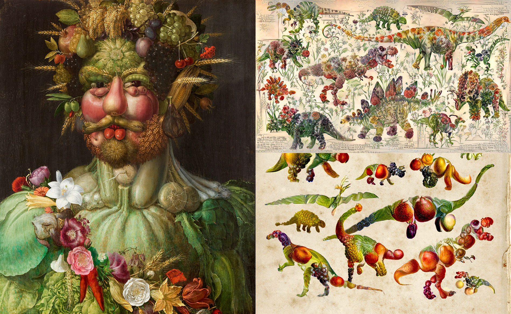
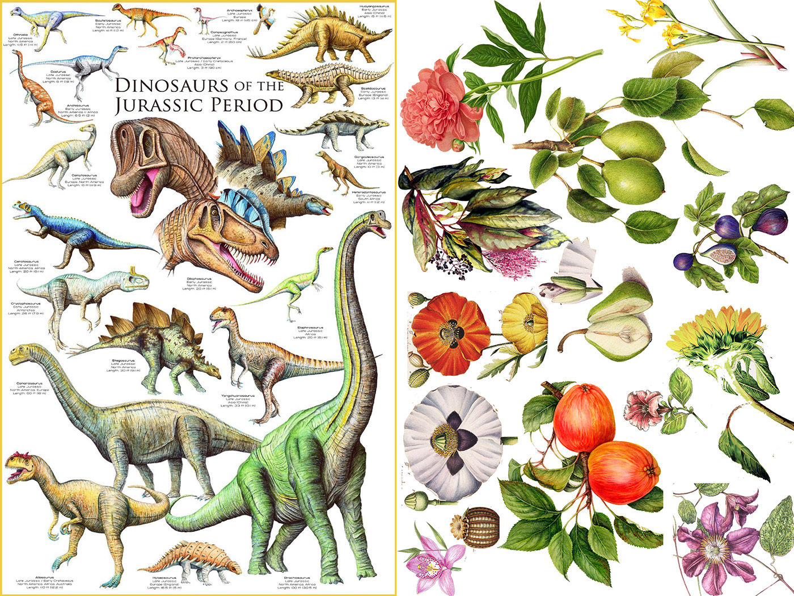
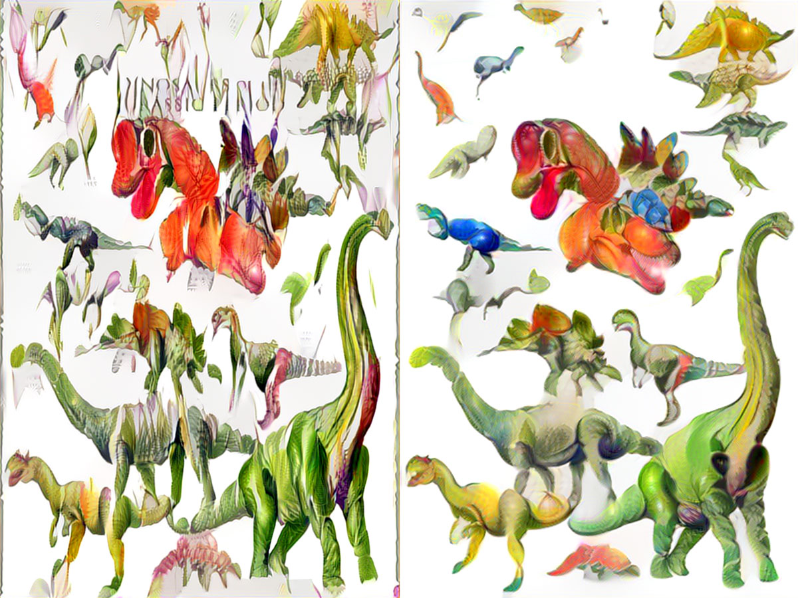
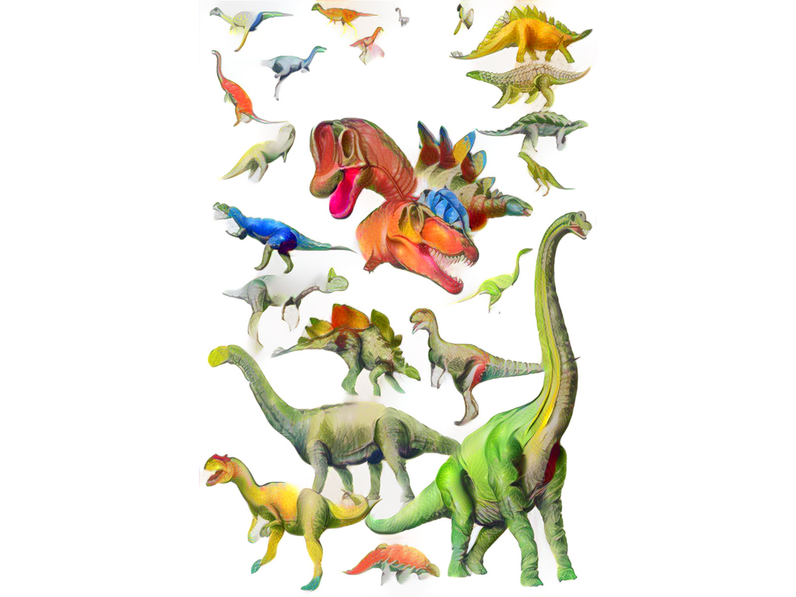
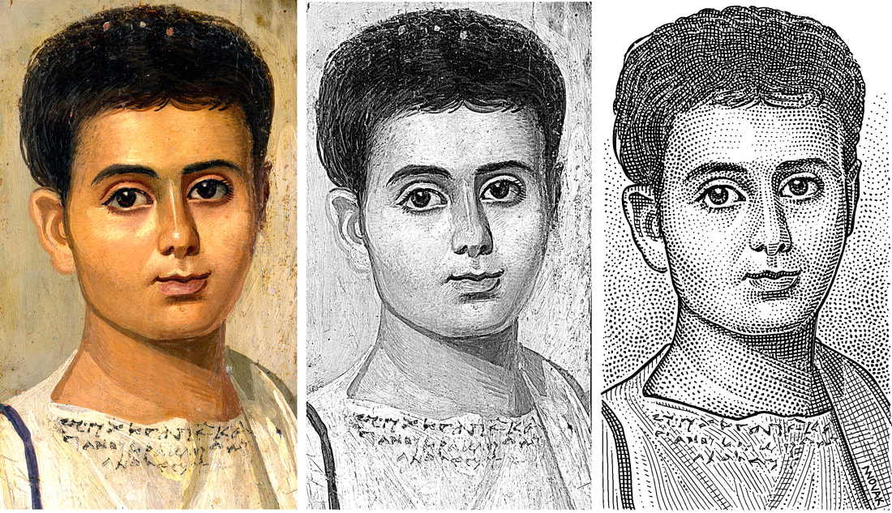
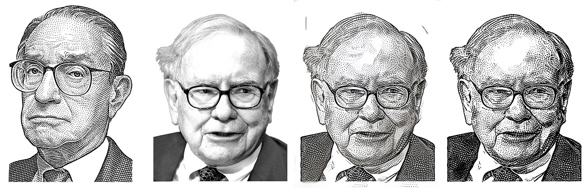
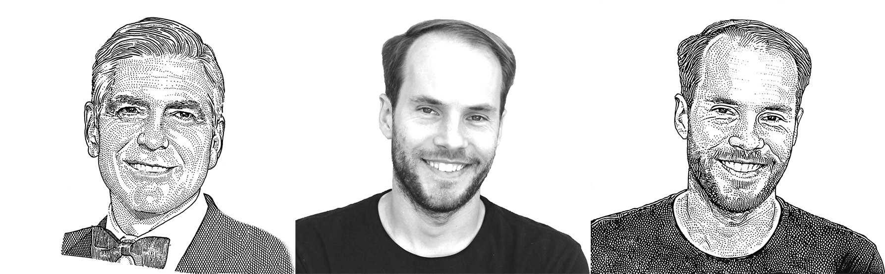

# Style Transfer Experiments


**General conclusion**: If you're looking for a specific result, it's hard to be completely automated. Each piece needs some manual pre- and post-processing (cleaning). Which is not too different from any ML endeavor. 

## Project 1: Creating objects out of other objects

My goal here is to generate something similar to the painting [*Vertumnus*](https://en.wikipedia.org/wiki/Vertumnus_(painting)) by Giuseppe Arcimboldo (below left). In other words, it should look like the subject of the painting is made out of plants/fruits/etc. Inspiration for this came from Chris Rodley's [Deep Dinosaur](https://chrisrodley.com/2017/06/19/dinosaur-flowers/) (below right). 



**Attempt #1**: Using the below target/source, experiment via manual hill climbing with the various network params of `Neural-Style-Transfer`. The params are harder than expected to get right. 



Below are a few of the outcomes:



Learnings from some of the specific parameters of the network:

- Image size -- makes image more detailed but also closer to original
- Style scale -- increases similarity to style
- Pooling type -- "avg" makes it look better
- Content weight -- seemingly no effect
- Content loss type -- no effect
- Model --  While vgg19 outputs have a crisper more accurate look, the vgg16 model gives it a closer look to the goal images.

At higher resolutions it would just be copying more of the colored pencil style rather than the fruits/plants themselves (see result below). 



There could be potential in using smaller style images, or multiple style images. So far the results haven't come close to matching the realism of *Vertumnus* or any of Chris's pieces.

## Project 2: Transferring a recognizable style (WSJ Stipple drawings)

Goal for this project is to replicate the [WSJ stipple drawing](https://www.wsj.com/video/how-wsj-stipple-drawings-are-made/91955BD8-9F31-4E50-AEF1-26A61B3AA2FB.html) style. [See here for more examples](http://www.hedcut.com/) from one of the artist's including the one below.



Emulating this drawing style properly is much harder than transferring the style of famous paintings. Most paintings, like the Monet or Van Gogh you commonly see in examples, are not very crisply defined and rarely have discreet elements. The models are made to copy brush stroke style and texture and so don't translate well to such a specifically defined drawing style. 

Some of the original researchers or others who know the more intimate workings of the network would be able to better tune this for a good result. Especially given something like the example above where you have a 1-to-1 mapping of source to target. 

Nonetheless, with some heavy pre- and post-editing of the images I was able to generate some decent results by only tweaking parameters of the original network.

**Path #1**: Use [EBSynth](https://github.com/jamriska/ebsynth) FaceStyle non-neural transfer. This was not as successful as hoped and relied too heavily on matching the specific facial features and contours using the 1-1 color gradient mappings. Results not worth showing here.

**Path #2**: Use traditional single and multiple-style transfer. This was much better. The key was in the pre- and post-processing of the images and selecting a good source image to sample from. Specific learnings below:

- Source image
    - **Using 1 source image is the best *if you can find a good HQ match*** (content, shading, etc.). If you can't, multi-style transfer with 2-3 similar is best.
    - Need hi-res source images or else result will be blurry.
    - Seems important to select similar content for source images. I.e. for Buffett, men with glasses or wearing suits.
    - Pre-edit source image to be same image size, roughly the same feature resolution.
- Target image/photo
    - Black and white with background removed
    - Pre-editing the target photo helped (as little pure black as possible, only pure white where no cross hatching is needed). Use exposure levels & contrast with some masking.
- Final result would still need post-production: cleanup of artifacts, levels enhancement, some manual cloning, etc.
- *Suggestion*: Do multiple separate single-source style transfers with different source images, then selectively chose different parts that look the best.

**Sample result #1** [*source, target, result, final cleaned version*]



**Sample result #2** [*source, target, final cleaned version*]



**Potential things to try:**

- Ultimately, best output would need something like **CycleGAN** to improve final result.
- Change size of convolution window in network to see how this affects result.


# Initializing repo from scratch

```
git submodule init
git submodule update
mkdir inputs
mkdir output
```


